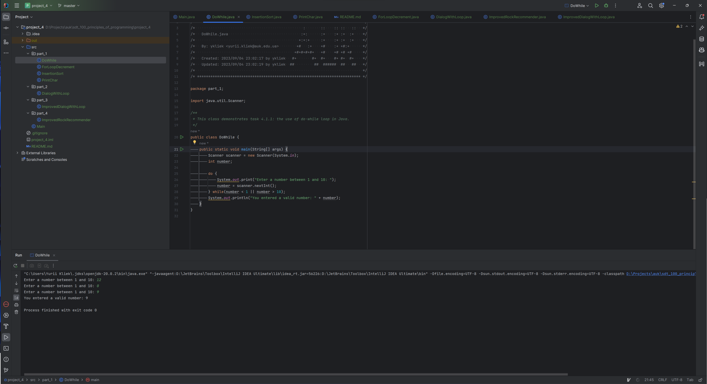
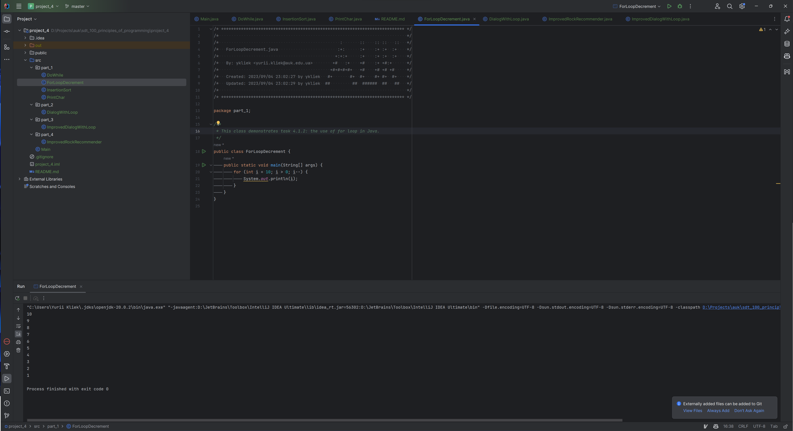
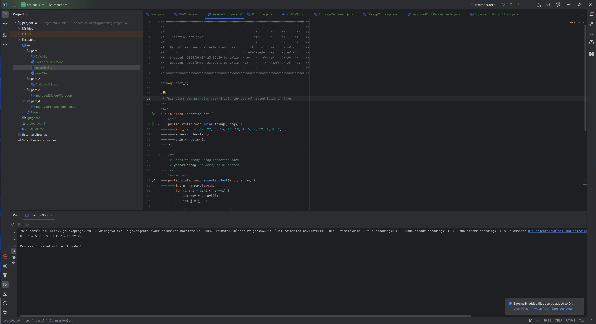
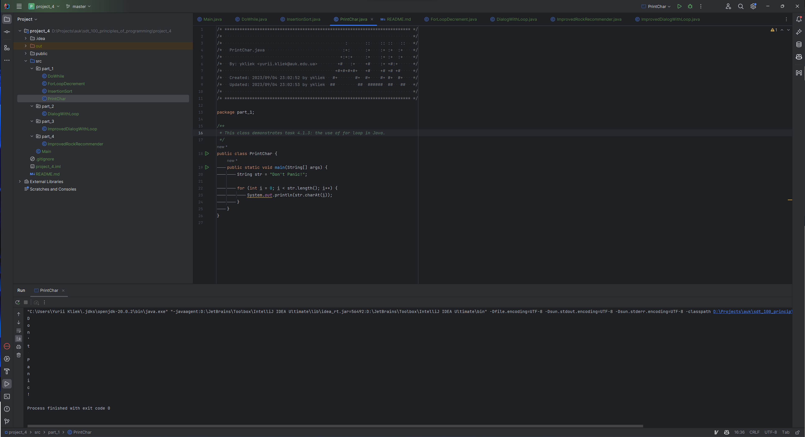
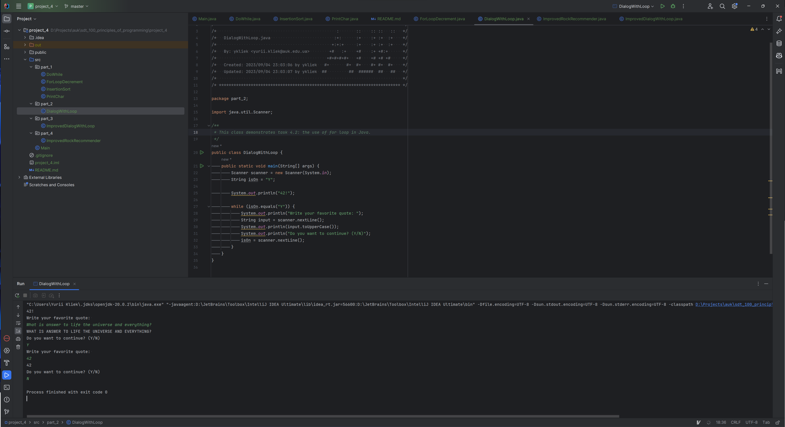
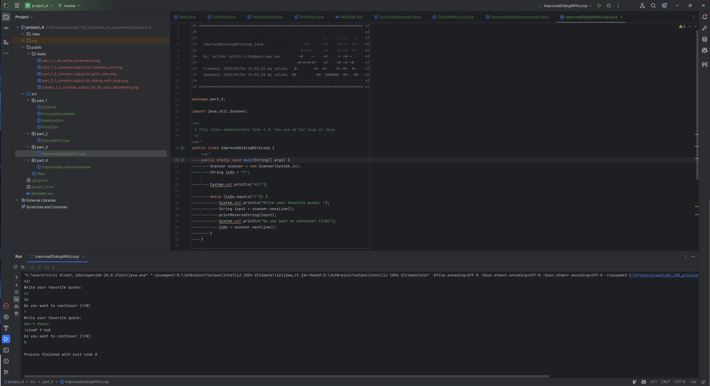
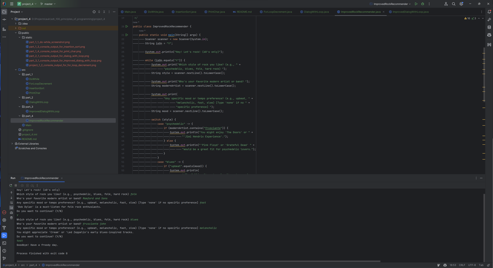

# UK SDT 100: Principles of Programming FA23: Project 4. Loops.

This project demonstrates various Java tasks related to loops.

## Table of Contents

- [Setup](#setup)
- [Project Structure](#project-structure)
- [Running the Programs](#running-the-programs)
- [Tasks Overview](#tasks-overview)
- [Contributors](#contributors)

## Setup

1. **Clone the Repository**
    ```bash
    git clone <repository-link>
    ```

2. Navigate to the `auk_project_4` directory.

3. Open the project in your preferred Java IDE.

## Project Structure

<pre>
project_3
│
├── public
│   └── static
│       └── [screenshots]
│
├── src
│   ├── part_1
│   │   └── DoWhile.java
│   │   └── ForLoopDecrement.java
│   │   └── InsertionSort.java
│   │   └── PrintChar.java
│   │
│   ├── part_2
│   │   └── DialogWithLoop.java
│   │
│   ├── part_3
│   │   └── ImprovedDialogWithLoop.java
│   │
│   └── part_4
│       └── ImprovedRockRecommender.java
│
├── .gitignore
├── README.md
└── project_4.iml
</pre>

- **public/static:** Houses static assets like screenshots and flowcharts related to each task.

- **src:** The source directory contains all the Java code, structured into packages according to task parts.

## Running the Programs

1. Navigate to the desired package under the `src` directory.
2. Run the `main` method of the desired Java file.

## Tasks Overview

### Part 1: While, for, do-while loops

- **File:** [DoWhile.java](src/part_1/DoWhile.java)



- Showcases using do-while loop.

- **File:** [ForLoopDecrement.java](src/part_1/ForLoopDecrement.java)



- Showcases using for loop using decrement.

- **File:** [InsertionSort.java](src/part_1/InsertionSort.java)



- Showcases using for while loop, for loop and nested loops.

- **File:** [PrintChar.java](src/part_1/PrintChar.java)



- Showcases iterating through String abd using chatAt() string method.

### Part 2: Dialog with loop

- **File:** [DialogWithLoop.java](src/part_2/DialogWithLoop.java)



### Part 3: ImprovedDialogWithLoop

- **File:** [ImprovedDialogWithLoop.java](src/part_3/ImprovedDialogWithLoop.java)



### Part 4: Improved Rock Recommender

- **File:** [ImprovedRockRecommender.java](src/part_4/ImprovedRockRecommender.java)


